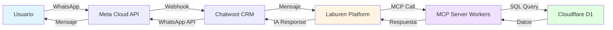
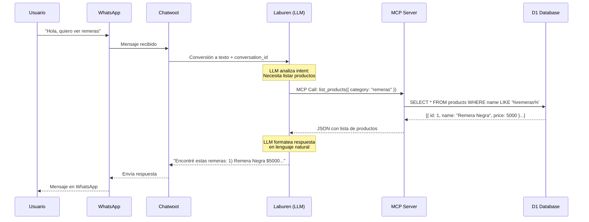
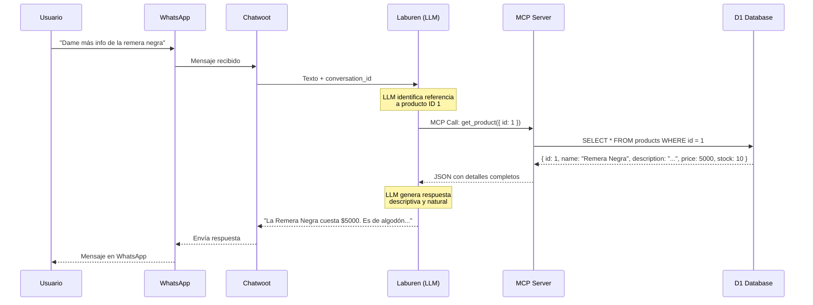
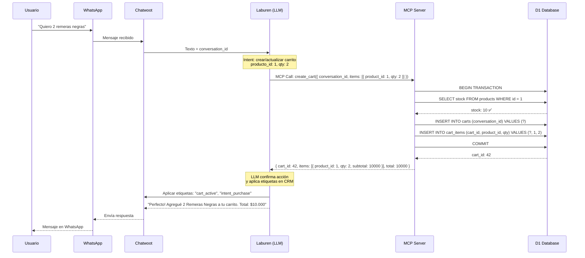
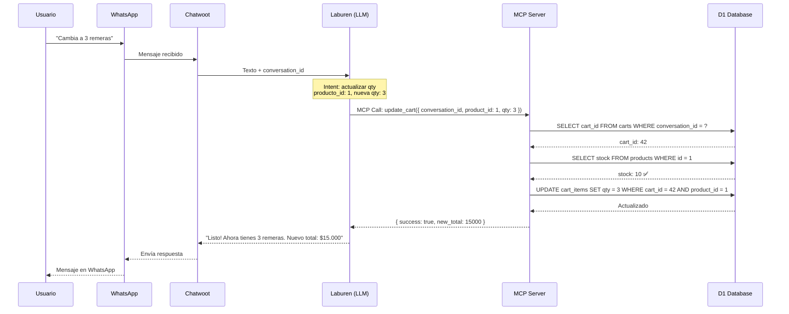
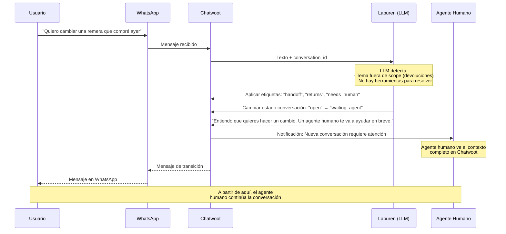

# 🤖 Flujo de Interacción del Agente - Laburen Challenge

Este documento describe los flujos de interacción entre el usuario y el agente de ventas por WhatsApp, detallando cómo los diferentes componentes del sistema se comunican entre sí.

## 📐 Arquitectura General

El sistema está compuesto por 6 componentes principales que se comunican en secuencia:



### Componentes:

1. **Usuario** - Cliente final que interactúa por WhatsApp
2. **Meta Cloud API** - API oficial de WhatsApp para envío/recepción de mensajes
3. **Chatwoot CRM** - Centro de control para gestión de conversaciones y etiquetado
4. **Laburen Platform** - Orquestador que ejecuta el LLM y decide qué herramientas usar
5. **MCP Server** - Cloudflare Worker que expone herramientas vía Model Context Protocol
6. **Cloudflare D1** - Base de datos SQLite edge con productos y carritos

---

## 🔄 Flujo 1: Explorar Productos (`list_products`)

El usuario solicita ver productos disponibles, el agente consulta la base de datos y retorna resultados.



**Parámetros:**

- `filters` (opcional): `{ name?, description?, min_price?, max_price? }`

**Respuesta:**

```json
{
  "products": [{ "id": 1, "name": "Remera Negra", "price": 5000, "stock": 10 }]
}
```

---

## 🔍 Flujo 2: Ver Detalle de Producto (`get_product`)

El usuario solicita información detallada sobre un producto específico.



**Parámetros:**

- `id` (requerido): ID del producto

**Respuesta:**

```json
{
  "id": 1,
  "name": "Remera Negra",
  "description": "Remera 100% algodón",
  "price": 5000,
  "stock": 10
}
```

---

## 🛒 Flujo 3: Crear Carrito (`create_cart`)

El usuario expresa intención de compra. El agente crea un carrito vinculado a la conversación.



**Parámetros:**

- `conversation_id` (requerido): ID único de la conversación
- `items` (requerido): Array de `{ product_id, qty }`

**Validaciones:**

- Verificar stock disponible antes de agregar
- Si no hay stock, retornar error descriptivo

**Respuesta:**

```json
{
  "cart_id": 42,
  "items": [{ "product_id": 1, "qty": 2, "subtotal": 10000 }],
  "total": 10000
}
```

---

## ✏️ Flujo 4: Actualizar Carrito (`update_cart`)

El usuario modifica cantidades o elimina productos del carrito.



**Parámetros:**

- `conversation_id` (requerido): ID de la conversación
- `product_id` (requerido): ID del producto a modificar
- `qty` (requerido): Nueva cantidad (si es 0, elimina el item)

**Reglas:**

- Si `qty = 0` → Eliminar el item del carrito
- Validar stock disponible
- Si el carrito queda vacío, considerar eliminar el carrito

**Respuesta:**

```json
{
  "success": true,
  "new_total": 15000,
  "items": [{ "product_id": 1, "qty": 3, "subtotal": 15000 }]
}
```

---

## 👤 Flujo 5: Derivar a Humano (`handoff_to_human`)

El agente detecta que no puede resolver la consulta y deriva a un agente humano.



**Triggers para handoff:**

- Usuario solicita hablar con humano explícitamente
- Consultas sobre devoluciones, cambios, reclamos
- El agente no puede responder después de 2 intentos
- Usuario expresa frustración o insatisfacción
- Temas de facturación o pagos específicos

**Acciones en Chatwoot:**

1. Aplicar etiquetas: `handoff`, `needs_human`, categoría del tema
2. Cambiar estado de la conversación
3. Agregar nota interna con contexto (productos vistos, carrito activo, etc.)
4. Notificar a agentes humanos disponibles

---

## 🎯 Resumen de Herramientas MCP

| Herramienta        | Propósito           | Input Principal                        | Output             |
| ------------------ | ------------------- | -------------------------------------- | ------------------ |
| `list_products`    | Buscar productos    | `filters` (opcional)                   | Array de productos |
| `get_product`      | Detalle de producto | `id`                                   | Objeto producto    |
| `create_cart`      | Crear carrito nuevo | `conversation_id`, `items`             | Carrito con total  |
| `update_cart`      | Modificar carrito   | `conversation_id`, `product_id`, `qty` | Nuevo total        |
| `handoff_to_human` | Derivar a humano    | `conversation_id`, `reason`            | Confirmación       |

---

## 🔐 Consideraciones de Seguridad

1. **Validación de Stock**: Siempre verificar disponibilidad antes de agregar/actualizar items
2. **Isolation por Conversación**: Cada `conversation_id` tiene su propio carrito
3. **Transacciones Atómicas**: Uso de `BEGIN/COMMIT` en operaciones de carrito
4. **Error Handling**: Respuestas descriptivas sin exponer detalles de DB
5. **Rate Limiting**: (Implementar si es necesario) Límite de requests por conversación

---

## 📊 Métricas Sugeridas

Para monitoreo y mejora continua:

- Tasa de conversión: Conversaciones → Carritos creados
- Productos más consultados
- Abandonos de carrito por falta de stock
- Tiempo promedio hasta handoff humano
- Tasa de handoff (qué % de conversaciones requieren humano)

---

## 🚀 Próximos Pasos

1. ✅ Implementar esquema de base de datos (D1)
2. ✅ Desarrollar cada herramienta MCP como función TypeScript
3. ⏳ Configurar servidor MCP en Cloudflare Worker
4. ⏳ Integrar con Laburen Platform
5. ⏳ Testing E2E en WhatsApp real
