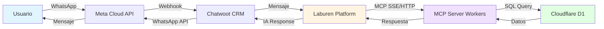
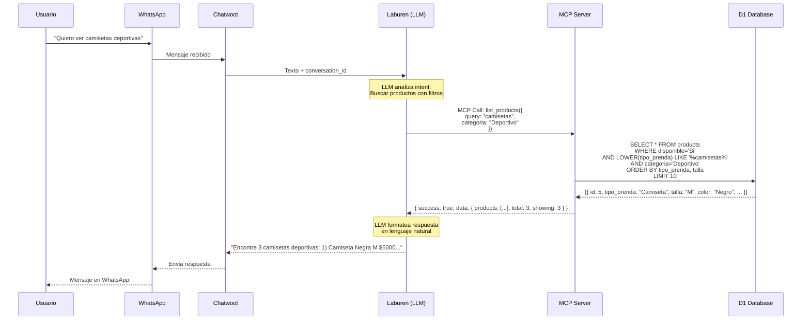
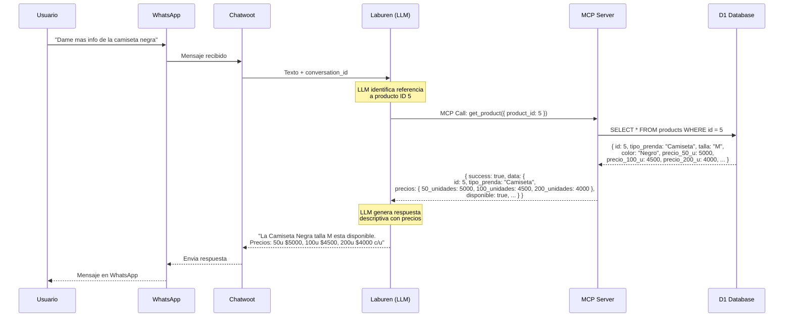
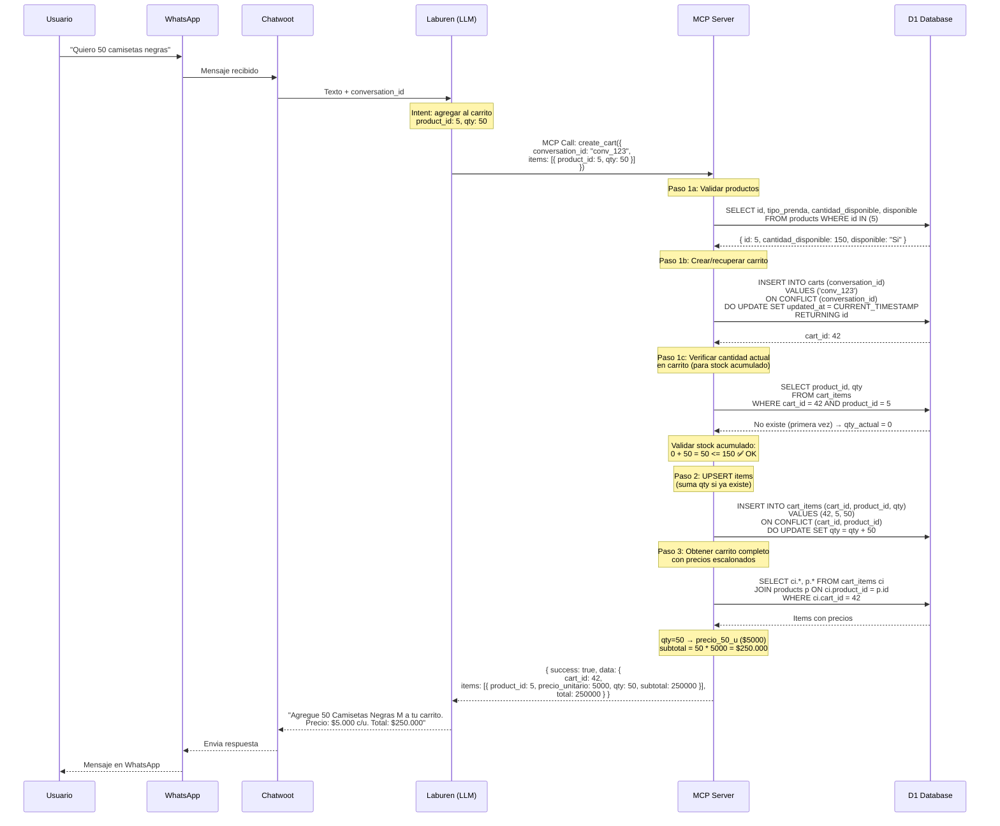
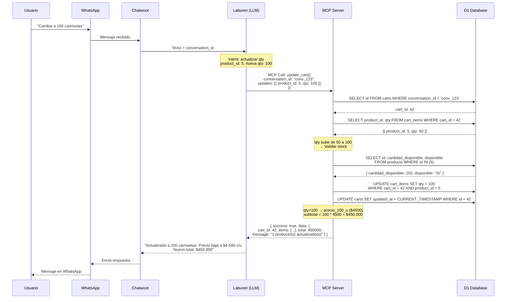
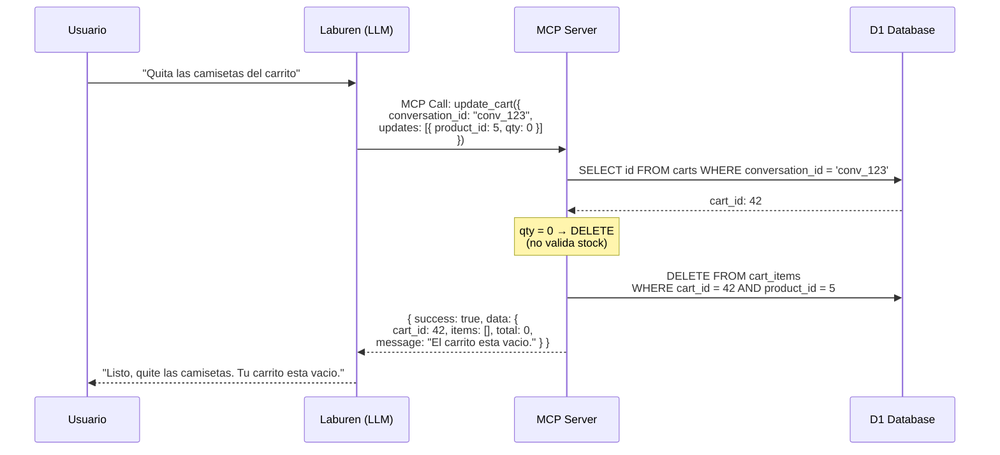
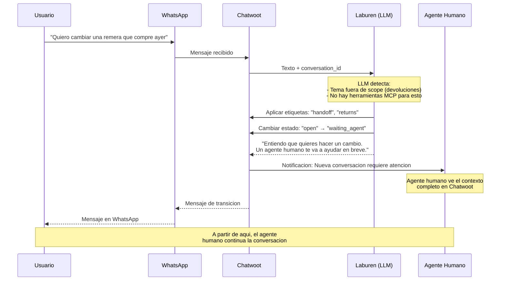

# Flujo de Interaccion del Agente - Laburen Challenge

Este documento describe los flujos de interaccion entre el usuario y el agente de ventas por WhatsApp, detallando como los diferentes componentes del sistema se comunican entre si.

## Arquitectura General

El sistema esta compuesto por 6 componentes principales que se comunican en secuencia:



### Componentes:

1. **Usuario** - Cliente final que interactua por WhatsApp
2. **Meta Cloud API** - API oficial de WhatsApp para envio/recepcion de mensajes
3. **Chatwoot CRM** - Centro de control para gestion de conversaciones y etiquetado
4. **Laburen Platform** - Orquestador que ejecuta el LLM y decide que herramientas usar
5. **MCP Server** - Cloudflare Worker con Durable Objects (`McpAgent`), transporte Streamable HTTP + SSE
6. **Cloudflare D1** - Base de datos SQLite edge con catalogo de indumentaria y carritos

---

## Flujo 1: Explorar Productos (`list_products`)

El usuario solicita ver productos disponibles. El agente busca en el catalogo con filtros opcionales.



**Parametros disponibles:**

| Parametro   | Tipo              | Descripcion                                 |
| ----------- | ----------------- | ------------------------------------------- |
| `query`     | string (opcional) | Busqueda en tipo_prenda, color, descripcion |
| `categoria` | enum (opcional)   | "Deportivo", "Casual", "Formal"             |
| `talla`     | enum (opcional)   | "S", "M", "L", "XL", "XXL"                  |
| `color`     | string (opcional) | Color exacto (case-insensitive)             |
| `limit`     | number (opcional) | Max resultados (default 10, max 50)         |

---

## Flujo 2: Ver Detalle de Producto (`get_product`)

El usuario solicita informacion detallada de un producto especifico. La respuesta incluye precios escalonados por volumen.



**Nota:** `get_product` convierte `disponible` de "Si"/"No" a booleano y agrupa los 3 precios en un objeto `precios` para que el LLM los presente claramente.

---

## Flujo 3: Crear Carrito (`create_cart`)

El usuario expresa intencion de compra. El agente crea un carrito o agrega productos a uno existente (UPSERT).



**Comportamiento UPSERT:**

- Si no existe carrito para ese `conversation_id` → crea uno nuevo
- Si ya existe → reutiliza el carrito existente
- **Si el producto ya está en el carrito → SUMA las cantidades** (ej: 50 + 50 = 100)
- **Validación de stock:** Considera la cantidad **acumulada** (actual en carrito + nueva solicitada), no solo la nueva
- Si el producto ya esta en el carrito → **suma** las cantidades

**Precios escalonados aplicados:**

| Cantidad en carrito | Precio unitario aplicado |
| ------------------- | ------------------------ |
| qty < 100           | `precio_50_u`            |
| 100 <= qty < 200    | `precio_100_u`           |
| qty >= 200          | `precio_200_u`           |

---

## Flujo 4: Actualizar Carrito (`update_cart`)

El usuario modifica cantidades o elimina productos del carrito.

### Caso A: Modificar cantidad



### Caso B: Eliminar item (qty = 0)



**Reglas de validacion:**

- Solo valida stock cuando se **incrementa** qty (optimizacion)
- `qty = 0` elimina el item sin validacion
- Si el producto no esta en el carrito, retorna error `item_not_found`
- El carrito se mantiene aunque quede vacio

---

## Flujo 5: Derivacion a Humano

El agente detecta que no puede resolver la consulta y la derivacion es manejada por Laburen Platform a traves de Chatwoot.



**Nota:** La derivacion a humano es manejada directamente por Laburen Platform y Chatwoot, sin necesidad de un tool MCP dedicado. El LLM detecta cuando no puede resolver y aplica etiquetas/cambios de estado en Chatwoot.

**Triggers para derivacion:**

- Usuario solicita hablar con humano explicitamente
- Consultas sobre devoluciones, cambios, reclamos
- El agente no puede responder la consulta
- Usuario expresa frustracion o insatisfaccion
- Temas de facturacion o pagos especificos

---

## Resumen de Herramientas MCP

| Herramienta     | Proposito                | Input Principal                                                    | Output                                 |
| --------------- | ------------------------ | ------------------------------------------------------------------ | -------------------------------------- |
| `list_products` | Buscar productos         | `query`, `categoria`, `talla`, `color`, `limit` (todos opcionales) | Array de productos con stock y precios |
| `get_product`   | Detalle de producto      | `product_id` (requerido)                                           | Producto con precios escalonados       |
| `create_cart`   | Crear/agregar al carrito | `conversation_id`, `items[]` (requeridos)                          | Carrito con items, precios y total     |
| `update_cart`   | Modificar carrito        | `conversation_id`, `updates[]` (requeridos)                        | Carrito actualizado con total          |

---

## Precios Escalonados por Volumen

El sistema aplica descuentos automaticos por volumen en cada operacion de carrito:

```
qty < 100   → precio_50_u  (precio base)
qty >= 100  → precio_100_u (descuento mediano)
qty >= 200  → precio_200_u (mejor precio)
```

**Ejemplo practico:**

- 50 camisetas a $5.000 c/u = $250.000
- 100 camisetas a $4.500 c/u = $450.000 (10% descuento)
- 200 camisetas a $4.000 c/u = $800.000 (20% descuento)

El precio se recalcula cada vez que se modifica la cantidad en el carrito.

---

## Consideraciones de Seguridad

1. **Validacion de Stock**: Siempre verificar disponibilidad antes de agregar items (solo en incrementos para update)
2. **Aislamiento por Conversacion**: Cada `conversation_id` tiene su propio carrito (UNIQUE constraint)
3. **Prepared Statements**: Todos los queries usan placeholders (`?`) contra SQL injection
4. **UPSERT Atomico**: `INSERT...ON CONFLICT` evita race conditions en creacion de carritos
5. **Error Handling**: Respuestas descriptivas con codigos de error estandar, sin exponer detalles de DB
6. **Validacion Zod**: Tipos validados en la capa MCP SDK antes de llegar al tool

---

## Estructura del Proyecto

```
src/
├── index.ts                  → Entry point: McpAgent (Durable Object) + routing
├── types.ts                  → Interfaces TypeScript (Env, DB types, tool args, responses)
├── db/
│   └── schema.sql            → Esquema D1 (products, carts, cart_items + indices)
├── tools/
│   ├── list-products.ts      → Busqueda con filtros dinamicos
│   ├── get-product.ts        → Detalle con precios escalonados
│   ├── create-cart.ts        → UPSERT carrito + items + validacion stock
│   └── update-cart.ts        → Modificar/eliminar items + validacion selectiva
└── utils/
    ├── response.ts           → Helpers de respuesta (success/error/MCP format)
    └── pricing.ts            → Calculo de precios escalonados por volumen
```
