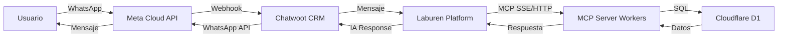
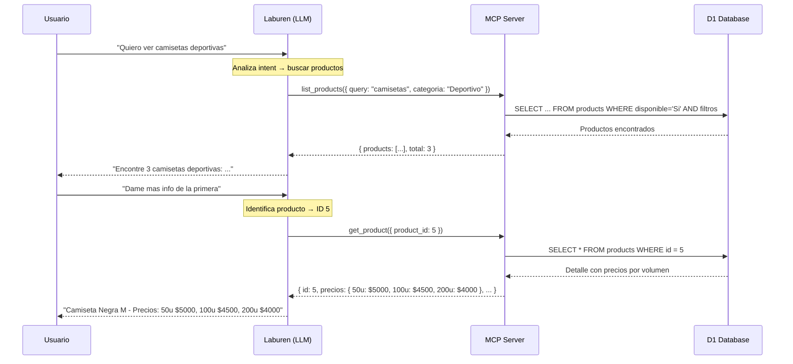
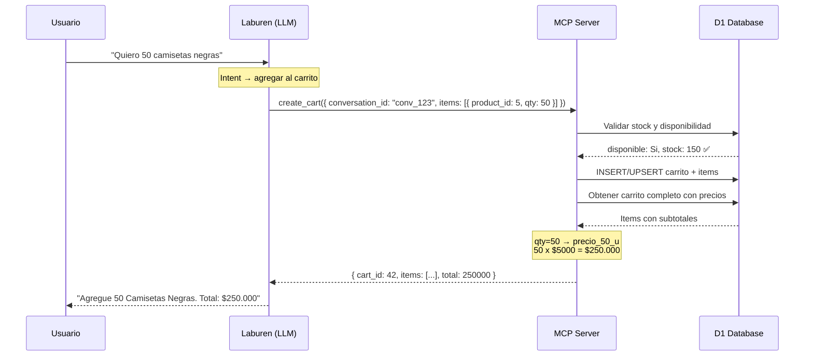
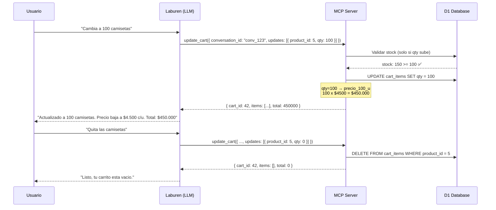

# Flujo de Interaccion del Agente de Ventas

## Arquitectura General

## Flujo 1: Explorar Productos

El usuario busca productos. El LLM invoca `list_products` (con filtros opcionales) o `get_product` (por ID) segun corresponda.

## Flujo 2: Crear Carrito

El usuario expresa intencion de compra. El MCP valida stock, crea/reutiliza el carrito (UPSERT por `conversation_id`) y aplica precios por volumen.

## Flujo 3: Editar Carrito (Extra)

El usuario modifica cantidades (`qty > 0`) o elimina items (`qty = 0`).

## Endpoints MCP

| Herramienta     | Proposito                | Input Principal                                                    | Output                                 |
| --------------- | ------------------------ | ------------------------------------------------------------------ | -------------------------------------- |
| `list_products` | Buscar productos         | `query`, `categoria`, `talla`, `color`, `limit` (todos opcionales) | Array de productos con stock y precios |
| `get_product`   | Detalle de producto      | `product_id` (requerido)                                           | Producto con precios escalonados       |
| `create_cart`   | Crear/agregar al carrito | `conversation_id`, `items[]` (requeridos)                          | Carrito con items, precios y total     |
| `update_cart`   | Modificar carrito        | `conversation_id`, `updates[]` (requeridos)                        | Carrito actualizado con total          |
| `apply_labels`  | Etiquetar conversacion   | `conversation_id`, `labels[]` (requeridos)                         | Labels aplicadas en Chatwoot           |

**URL de produccion:** `https://laburen-challenge-mcp.laburen-challenge.workers.dev/mcp`
**Transporte:** Streamable HTTP + SSE (MCP SDK)
